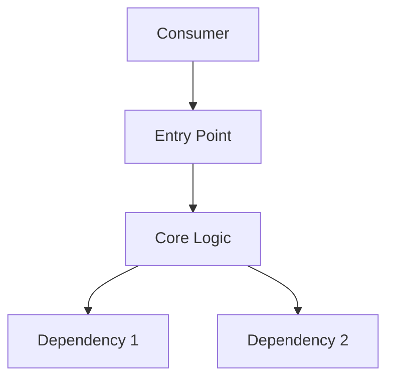

# Doc Gen — Documentation Generator

This skill generates or updates documentation for modules, tools, APIs, and infrastructure. It produces README files, API references, and Mermaid architecture diagrams.

## When to Use

Invoke after completing an implementation task that:
- Creates a new tool, script, or module
- Adds or changes a public API
- Modifies infrastructure or deployment
- Changes architectural patterns

## Workflow

### Step 1: Analyze the Implementation

Use code-memory to understand what was built:

```bash
# List exported symbols (the public API)
npx code-memory exports [main-file]

# Understand dependencies
npx code-memory deps [main-file] --direction both

# Find related files
npx code-memory files "[module-glob]"
```

Read the task file for:
- Objective (what was built and why)
- Acceptance criteria (what it should do)
- Contracts (interfaces it implements)

### Step 2: Generate/Update README

If the module has no README, create one. If it exists, update it.

**README structure**:
```markdown
# [Module Name]

[One-paragraph description of what this module does and why it exists]

## Quick Start

[Minimal example to get started — the most common use case]

## Commands / API

[Reference table or list of all public functions, CLI commands, or API endpoints]

## Configuration

[Any configuration options, environment variables, or settings]

## Architecture

[Mermaid diagram showing key components and their relationships]

## Development

[How to test, build, and contribute to this module]
```

### Step 3: Generate Architecture Diagram

Create a Mermaid diagram showing the module's structure:

```markdown

```

Use dependency information from code-memory to make the diagram accurate.

### Step 4: Generate API Reference

For each exported symbol:
- Name and kind (function, class, type, const)
- Parameters/arguments with types
- Return type
- Brief description of behavior
- Example usage (if non-obvious)

### Step 5: Verify

- Ensure all code examples in documentation are syntactically correct
- Check that referenced file paths exist
- Verify Mermaid diagrams render correctly (valid syntax)

## Guidelines

- Write for the person who will use this module, not the person who built it
- Lead with the most common use case, not the most complex one
- Keep API references terse — one line per function unless the behavior is surprising
- Use Mermaid for diagrams (renders natively in GitHub and Obsidian)
- Only document stable interfaces — skip internal helpers and implementation details
